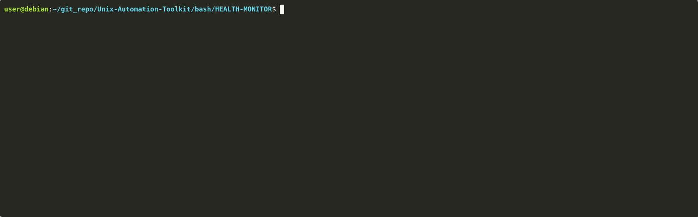
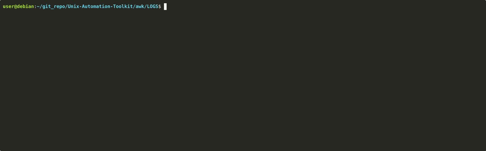
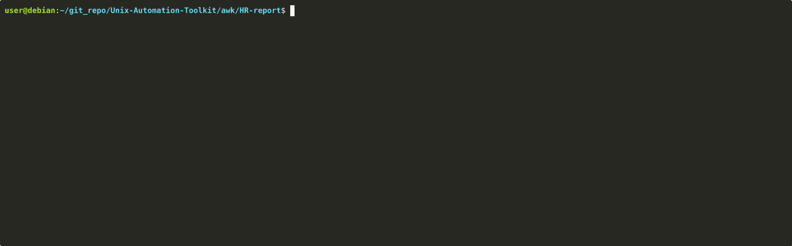

# 🛠️ Multi-Platform Automation Toolkit

A comprehensive collection of scripts for Linux (Bash, AWK) and Windows (PowerShell) environments.

---

## 🚀 Featured Tools & Demos

### 🐧 Linux Automation (Bash)
**System Health Monitor**
Monitor CPU, RAM, and Disk usage with real-time visual alerts.

### 📊 Data Processing (AWK)
**Log Parser**
Efficiently analyze massive server logs to extract security insights.

**HR Report**
Tool for generating comprehensive HR reports from employee CSV data.

### 🪟 Windows Automation (PowerShell)
**User Auditor**
Automated reporting for local or Active Directory user accounts.

---

## 📂 Navigation

- [Bash Scripts](./bash) - Linux system administration.
- [AWK Utilities](./awk) - Advanced text & log processing.
- [PowerShell](./powershell) - Windows automation & management.
